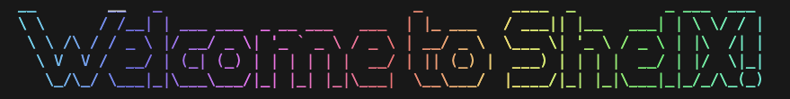

# Shell (Replica)

## Introduction

This project was built to complete the coding challenge from https://codingchallenges.fyi

## Goal

Refer to https://codingchallenges.fyi/challenges/challenge-shell for more details regarding the goal of the challenge and what needs to be implemented.

Note: 
- You have to have your own environment variable for the path of the file where the history of all commands executed will be written

- You have to be in the shell folder to allow env variable to work properly. Otherwise, you would have to hard code the path to the history file if you want to use the shell from anywhere in your computer

## Usage

Install all dependecies with npm install then the command 'ccsh' in the terminal to enter the shell.